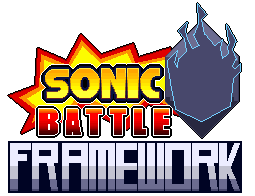

# Sonic Battle Framework

An open source remake of Sonic Battle in the Godot engine that aims to turn it into a moddable framework. Our goal is to not only recreate Sonic Battle but also create a 3D fighting game engine that supports custom content (similar to MUGEN). Developers can also fork this repo to modify the engine and create their own 3D fighting game.

### Godot Version
This project is currently using Godot 4.4 Stable.

### Project Status
This project is currently in a very rough "proof-of-concept" state. It contains 4 playable characters and the basic Sonic Battle gameplay loop. It is currently not suitable to be used as a framework and we're working on reworking the codebase to be cleaner and easier to work with.

### Current Roadmap
The next major release, 0.2.0 will focus on refactoring the game's codebase to make it easier to create new characters and attacks. The gameplay code will also be reworked to support deterministic online netcode.