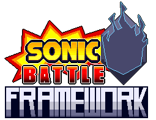

# Sonic Battle Framework

An open source remake of Sonic Battle in the Godot engine that aims to turn it into a moddable framework. Our goal is to not only recreate Sonic Battle but also create a 3D fighting game engine that supports custom content (similar to MUGEN). Developers can also fork this repo to modify the engine and create their own 3D fighting game.

### Godot Version
This project runs on godot 4.6.

### Project Status
This project is currently in a very rough "proof-of-concept" state. It contains 4 playable characters and the basic Sonic Battle gameplay loop. It is currently not suitable to be used as a framework and we're working on reworking the codebase to be cleaner and easier to work with.

### TODO (march 2026)
 - Full touch gamepad overlay with all ingame controls (Done)
 - Toggle in options menu to enable/disable touchscreen overlay (Done)
 - Android export config (Done)
 - Emerald town 3D sketch for story mode
 - Fix pause mode

### TODO (april 2026)
 - Fix scaling and positioning issues on ingame split-screen UI
 - Character mod system (external files, metadata format, etc.)
 - Dialogue sequence system with avatars
 - CPU character behaviour

### BACKLOG (coarse-grained, not yet scheduled)
 - 2.5D sidescroller sequences for story mode
 - Story mode chapter select with per-chapter animated backgrounds.
 - environmental hazard props (cacti, jagged walls, poison clouds, speed pads, etc.)
 - themed UI
 - Character moveset rework
